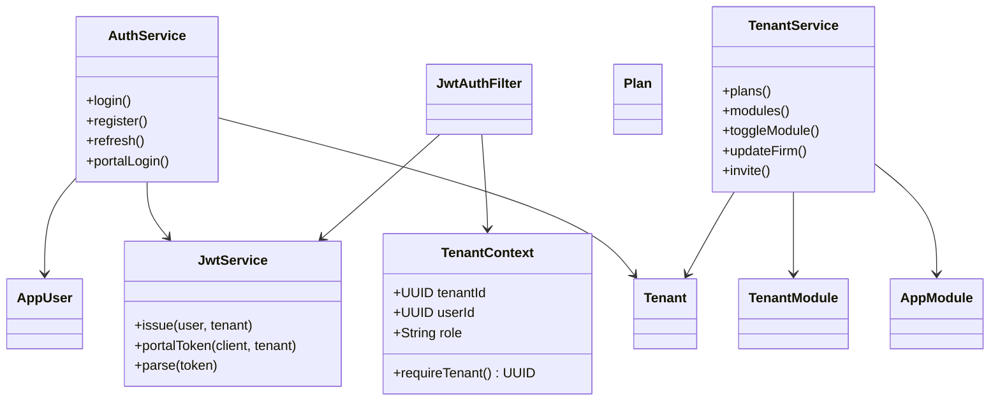
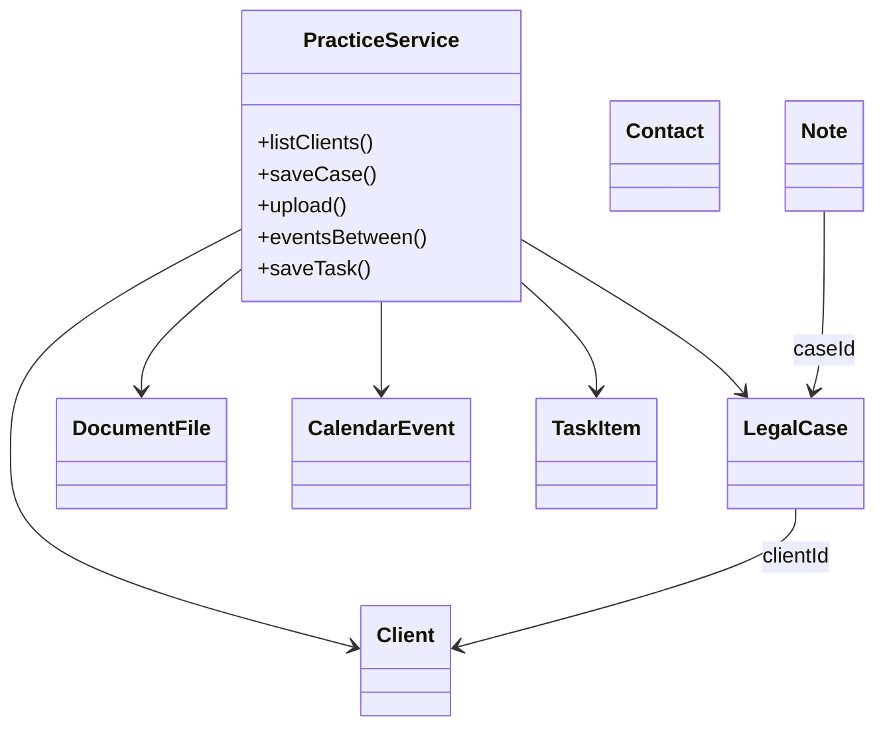
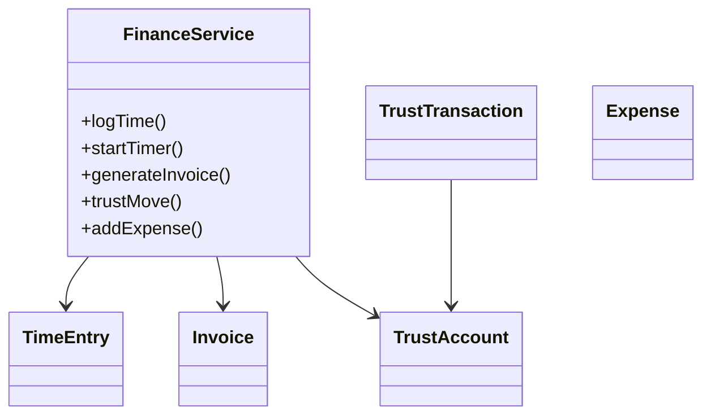
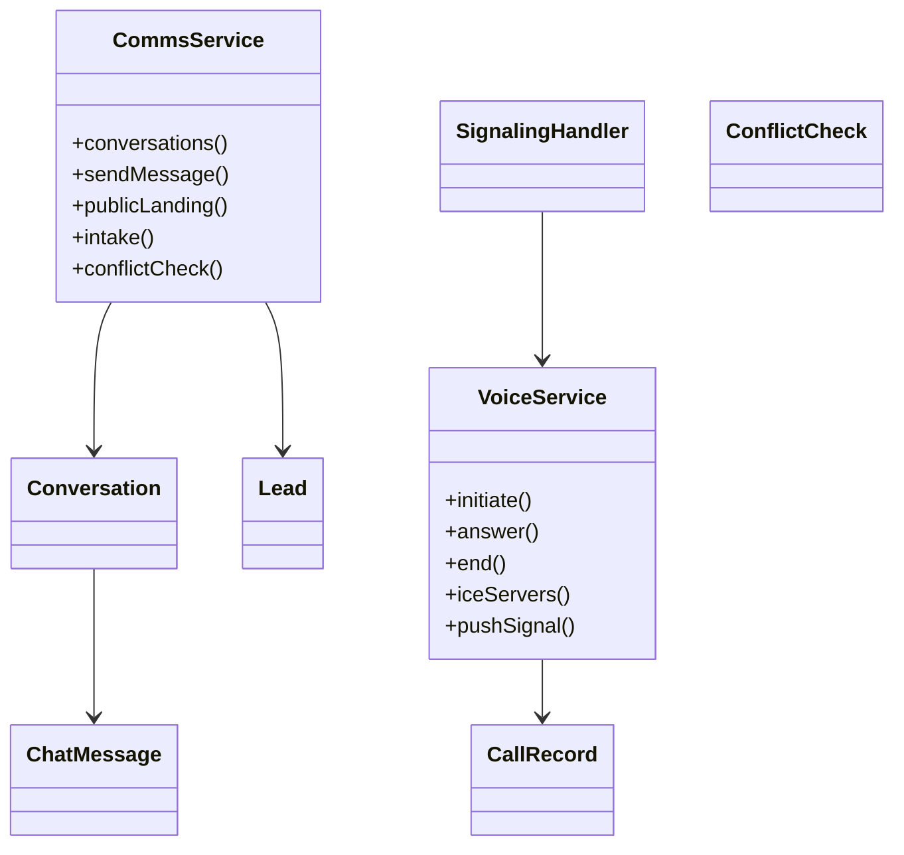
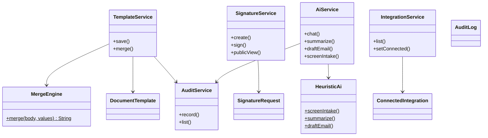
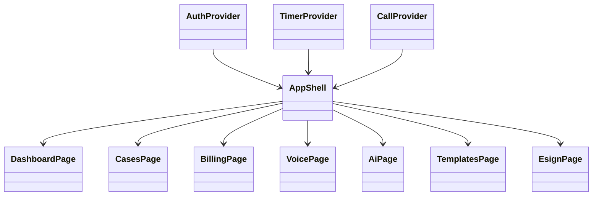

# Class diagrams

Package-level views of the Spring Boot modular monolith. UI pages in Next.js map 1:1 onto these services via `/api/v1`.

## Auth, tenant, modules

## Practice

## Finance

## Voice and messaging

## AI, templates, e-sign, integrations

## Frontend (Next.js)

