# Star ERD

Every satellite table hangs off **Tenant** via `tenant_id`. That is the star: the firm is the hub, practice and billing facts are the spokes.

```mermaid
erDiagram
    TENANT ||--o{ APP_USER : employs
    TENANT ||--o{ TENANT_MODULE : enables
    TENANT ||--o{ LANDING_PAGE : publishes
    TENANT ||--o{ CLIENT : serves
    TENANT ||--o{ LEGAL_CASE : dockets
    TENANT ||--o{ CONTACT : stores
    TENANT ||--o{ DOCUMENT_FILE : files
    TENANT ||--o{ DOCUMENT_TEMPLATE : authors
    TENANT ||--o{ SIGNATURE_REQUEST : sends
    TENANT ||--o{ CALENDAR_EVENT : schedules
    TENANT ||--o{ TASK_ITEM : assigns
    TENANT ||--o{ TIME_ENTRY : logs
    TENANT ||--o{ INVOICE : bills
    TENANT ||--o{ TRUST_ACCOUNT : holds
    TENANT ||--o{ EXPENSE : advances
    TENANT ||--o{ CONVERSATION : threads
    TENANT ||--o{ CALL_RECORD : records
    TENANT ||--o{ OUTBOUND_MESSAGE : sends
    TENANT ||--o{ FIRM_PHONE_NUMBER : presents
    TENANT ||--o{ LEAD : intakes
    TENANT ||--o{ CONFLICT_CHECK : searches
    TENANT ||--o{ CONNECTED_INTEGRATION : connects
    TENANT ||--o{ AUDIT_LOG : traces
    TENANT ||--o{ APP_NOTIFICATION : notifies
    PLAN ||--o{ TENANT : prices
    APP_MODULE ||--o{ TENANT_MODULE : catalog
    CLIENT ||--o{ LEGAL_CASE : matters
    LEGAL_CASE ||--o{ NOTE : annotates
    LEGAL_CASE ||--o{ TIME_ENTRY : time
    CLIENT ||--o{ INVOICE : receives
    TRUST_ACCOUNT ||--o{ TRUST_TRANSACTION : ledger
    CONVERSATION ||--o{ CHAT_MESSAGE : contains

    TENANT {
        uuid id PK
        string firm_name
        string slug UK
        uuid plan_id FK
        string status
    }
    PLAN {
        uuid id PK
        string slug
        int price_monthly
    }
    APP_MODULE {
        uuid id PK
        string slug
        boolean core
        int price_monthly
    }
    APP_USER {
        uuid id PK
        uuid tenant_id FK
        string email
        string role
    }
    CLIENT {
        uuid id PK
        uuid tenant_id FK
        string display_name
        boolean portal_enabled
    }
    LEGAL_CASE {
        uuid id PK
        uuid tenant_id FK
        uuid client_id FK
        string case_number
        string status
        date statute_of_limitations
    }
    TIME_ENTRY {
        uuid id PK
        uuid tenant_id FK
        uuid case_id FK
        int duration_minutes
        boolean billable
    }
    INVOICE {
        uuid id PK
        uuid tenant_id FK
        uuid client_id FK
        string status
        decimal total
    }
    TRUST_ACCOUNT {
        uuid id PK
        uuid tenant_id FK
        decimal balance
    }
    CALL_RECORD {
        uuid id PK
        uuid tenant_id FK
        string call_type
        int duration_seconds
        decimal total_cost
        string from_number
        string to_number
    }
    FIRM_PHONE_NUMBER {
        uuid id PK
        uuid tenant_id FK
        string e164
        string kind
        string status
    }
    OUTBOUND_MESSAGE {
        uuid id PK
        uuid tenant_id FK
        uuid case_id FK
        string channel
        string status
        decimal unit_cost
    }
    SIGNATURE_REQUEST {
        uuid id PK
        uuid tenant_id FK
        string status
        text signature_data_url
    }
    AUDIT_LOG {
        uuid id PK
        uuid tenant_id FK
        string action
        uuid actor_id
    }
```

## Notes

- `RefreshToken` is omitted from the diagram; it is an auth satellite of `APP_USER`.
- Seed documents may use a `seed://` storage key and are not downloadable until a real file is uploaded.
- Landing pages are 1:1 with tenant (`LANDING_PAGE.tenant_id` unique in practice).
- `USAGE_INVOICE` is the month-end bill to LegalSuite (modules + PSTN + SMS + WhatsApp), separate from client `INVOICE` rows.
